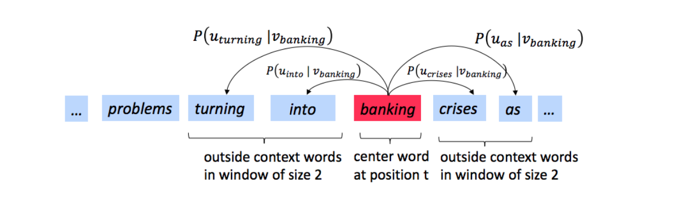
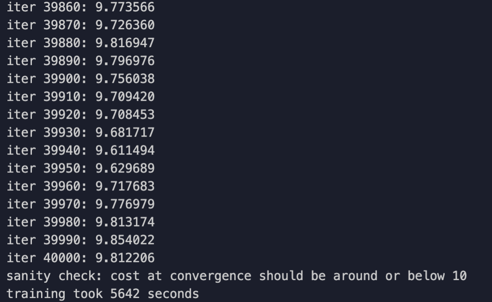

# CS 224n Assignment #2: word2vec (43 Points)
## Written: Understanding word2vec (23 points)
Let's have a quick refresher on the word2vec algorithm.  The key insight behind word2vec is that '*a word is known by the company it keeps*'.  Concretely, suppose we have a 'center' word $c$ and a contextual window surrounding $c$.  We shall refer to words that lie in this contextual window as 'outside words'.  For example, in Figure 1 we see that the center word $c$ is 'banking'.  Since the context window size is 2, the outside words are 'turning', 'into', 'crises', and 'as'.

The goal of the skip-gram word2vec algorithm is to accurately learn the probability distribution $P(O|C)$. Given a specific word $o$ and a specific word $c$, we want to calculate $P(O=o|C=c)$, which is the probability that word $o$ is an 'outside' word for $c$, i.e., the probability that $o$ falls within the contextual window of $c$.


<center>Figure 1:  The word2vec skip-gram prediction model with window size 2</center>

In word2vec, the conditional probability distribution is given by taking vector dot-products and applying the softmax function:
$$P(O=o|C=c) = \frac{exp(u_0^Tv_c)}{\sum_{w\in{Vocab}}exp(u_w^Tv_c)} (1)$$

Here, $u_o$ is the 'outside' vector representing outside word $o$, and $v_c$ is the 'center' vector representing center word $c$.  To contain these parameters, we have two matrices, $U$ and $V$.  The columns of $U$ are all the 'outside' vectors $u_w$.  The columns of $V$ are all of the 'center' vectors $v_w$.  Both $U$ and $V$ contain a vector for every $w \in$ Vocabulary$^1$.

Recall from lectures that, for a single pair of words $c$ and $o$, the loss is given by:
$$J_{naive-softmax}(v_c,o,U) = −logP(O=o|C=c) (2)$$

Another way to view this loss is as the cross-entropy$^2$ between the true distribution $y$ and the predicted distribution $\hat y$.  Here, both y and $\hat y$ are vectors with length equal to the number of words in the vocabulary. Furthermore, the $k^{th}$ entry in these vectors indicates the conditional probability of the $k^{th}$ word being an 'outside word' for the given $c$.  The true empirical distribution $y$ is a one-hot vector with a 1 for the true out-side word $o$, and 0 everywhere else.  The predicted distribution $\hat y$ is the probability distribution $P(O|C=c)$ given by our model in equation (1).

(a)(3 points) Show that the naive-softmax loss given in Equation (2) is the same as the cross-entropy loss between $y$ and $\hat y$; i.e., show that

$$−\sum_{w\in Vocab}y_wlog(\hat y_w) =−log(\hat y_o)$$
Your answer should be one line.

> Answer: Since the true distribution y is a one-hot vector, the left part of the equation can be simplified with only word $o$ inside window.

(b)(5 points) Compute the partial derivative of $J_{naive-softmax}(v_c,o,U)$ with respect to $v_c$.  Please write your answer in terms of $y,\hat y$, and $U$.

>Answer:
> Note $T = \partial J_{naive_softmax}(v_c, o, U) / \partial v_c$
>
>$T = \partial (-log(\frac{exp(u_0^T v_c)}{\sum_{w \in {Vocab}}exp(u_w^T v_c)}) / \partial v_c)$
>
>$T = - \partial [log(exp(u_o^T v_c)) - log(\sum_{w \in {Vocab}}exp(u_w^T v_c))] / \partial v_c$
>
>$T = - u_o + \partial log(\sum_{w \in {Vocab}}exp(u_w^T v_c)) / \partial v_c$
>
>$T = - u_o + \frac{1}{\sum_{w \in {Vocab}}exp(u_w^T v_c)}\partial \sum_{x \in {Vocab}}exp(u_x^T v_c) / \partial v_c$
>
>$T = - u_o + \frac{1}{\sum_{w \in {Vocab}}exp(u_w^T v_c)} \sum_{x \in {Vocab}} \partial exp(u_x^T v_c) / \partial v_c$
>
>$T = - u_o + \frac{1}{\sum_{w \in {Vocab}}exp(u_w^T v_c)} \sum_{x \in {Vocab}} exp(u_x^T v_c) \partial (u_x^T v_c) / \partial v_c$
>
>$T = - u_o + \frac{1}{\sum_{w \in {Vocab}}exp(u_w^T v_c)} \sum_{x \in {Vocab}} exp(u_x^T v_c)u_x$
>
>$T = - u_o + \sum_{x \in {Vocab}} \frac{exp(u_x^T v_c)}{\sum_{w \in {Vocab}}exp(u_w^T v_c)}u_x$
>
>$T = - u_o + \sum_{x \in {Vocab}} P(x|C=c)u_x$
>
>Above equation assumes that the derivation is the expected outside word vector minus real outside word vector, so the matrix form is:
>$T = U(\hat y - y)$

(c)(5 points) Compute the partial derivatives of$J_{naive-softmax}(v_c,o,U)$ with respect to each of the 'outside' word vectors, $u_w$'s.  There will be two cases:  when $w = o$, the true 'outside' word vector, and $w \neq o$, for all other words.  Please write you answer in terms of $y,\hat y$, and $v_c$.

>Answer:
>1. $w = o$
>   Note $T = \partial J_{naive_softmax}(v_c, o, U) / \partial u_o$
>   $T = \partial (-log(\frac{exp(u_0^T v_c)}{\sum_{w \in {Vocab}}exp(u_w^T v_c)}) / \partial u_o)$
>   $T = - \partial [log(exp(u_o^T v_c)) - log(\sum_{w \in {Vocab}}exp(u_w^T v_c))] / \partial u_o$
>   $T = - v_c + \partial log(\sum_{w \in {Vocab}}exp(u_w^T v_c)) / \partial u_o$
>   $T = - v_c + \frac{1}{\sum_{w \in {Vocab}}exp(u_w^T v_c)} \partial \sum_{w \in {Vocab}}exp(u_w^T v_c) / \partial u_o$
>   $T = - v_c + \frac{1}{\sum_{w \in {Vocab}}exp(u_w^T v_c)} \partial exp(u_o^T v_c) / \partial u_o$
>   $T = - v_c + \frac{1}{\sum_{w \in {Vocab}}exp(u_w^T v_c)} exp(u_o^T v_c)\partial(u_o^T v_c) / \partial u_o$
>   $T = - v_c + \frac{1}{\sum_{w \in {Vocab}}exp(u_w^T v_c)} exp(u_o^T v_c)v_c$
>   $T = - v_c + \frac{exp(u_o^T v_c)}{\sum_{w \in {Vocab}}exp(u_w^T v_c)}v_c$
>   $T = (P(O=o|C=c) - 1)v_c$
>   $T = (\hat y_w - 1)v_c$
>2. $w \neq o$
>   Note $R = \partial J_{naive_softmax}(v_c, o, U) / \partial u_w$
>   $R = \partial (-log(\frac{exp(u_0^T v_c)}{\sum_{w \in {Vocab}}exp(u_w^T v_c)}) / \partial u_w)$
>   $R = - \partial [log(exp(u_o^T v_c)) - log(\sum_{w \in {Vocab}}exp(u_w^T v_c))] / \partial u_w$
>   $R = 0 + \partial log(\sum_{w \in {Vocab}}exp(u_w^T v_c)) / \partial u_w$
>   $R = \frac{1}{\sum_{w \in {Vocab}}exp(u_w^T v_c)} \partial \sum_{x \in {Vocab}}exp(u_x^T v_c) / \partial u_w$
>   $R = \frac{1}{\sum_{w \in {Vocab}}exp(u_w^T v_c)} \partial exp(u_w^T v_c) / \partial u_w$
>   $R = \frac{1}{\sum_{w \in {Vocab}}exp(u_w^T v_c)} exp(u_w^T v_c) \partial(u_w^T v_c) / \partial u_w$
>   $R = \frac{1}{\sum_{x \in {Vocab}}exp(u_x^T v_c)} exp(u_w^T v_c)v_c$
>   $R = \frac{exp(u_x^T v_c)}{\sum_{w \in {Vocab}}exp(u_w^T v_c)}v_c$
>   $R = P(O=w|C=c)v_c$
>   $R = \hat y_w v_c$
>
>In summary, $\partial J / \partial U = v_c(\hat y - y)^T$

(d)(3 Points) The sigmoid function is given by Equation 4:
$$\sigma(x) = \frac{1}{1+e^{-x}} = \frac{e^x}{e^x+1}(4)$$
Please compute the derivative of $\sigma(x)$ with respect to $x$, where $x$ is a vector.

>Answer:
> Note $T = \partial \sigma(x) / \partial x$
> $T = \partial \frac{e^x}{e^x + 1} / \partial x$
> $T = \frac{(e^x + 1)\partial e^x / \partial x - e^x \partial (e^x+1) / \partial x}{(e^x + 1)^2}$
> $T = \frac{(e^x+1)e^x - e^x \times e^x}{(e^x + 1)^2}$
> $T = \frac{e^x}{e^x+1} - (\frac{e^x}{e^x + 1})^2$
> $T = \sigma(x) - (\sigma(x))^2$
> $T = \sigma(x)(1 - \sigma(x))$

(e)(4  points)  Now we shall  consider the Negative Sampling  loss, which is an alternative  to  the Naive Softmax loss. Assume that $K$ negative samples (words) are drawn from the vocabulary.  For simplicity of notation we shall refer to them as $w_1,w_2,\dots,w_K$ and their outside vectors as $u_1,\dots,u_K$.  Note that $o \notin {w_1,\dots,w_K}$.  For a center word $c$ and an outside word $o$, the negative sampling loss function is given by:
$$J_{neg-sample}(v_c,o,U) = −log(\sigma(u_o^T v_c)) − \sum_{k=1}^{K}log(\sigma(−u^T_k v_c))(5)$$
for a sample $w_1,\dots,w_K$, where $\sigma(·)$ is the sigmoid function$^3$.
Please repeat parts (b) and (c), computing the partial derivatives of $J_{neg-sample}$ with respect to $v_c$, with respect  to $u_o$,  and  with  respect  to  a  negative  sample $u_k$. Please  write  your  answers in terms of the vectors $u_o$,$v_c$, and $u_k$, where $k\in[1,K]$. After you've done this, describe with one sentence why this loss function is much more efficient to compute than the naive-softmax loss.  Note, you should be able to use your solution to part (d) to help compute the necessary gradients here.

>Answer:
>1. For $v_c$
>   Note $T = \partial J_{neg-sample}(v_c, o, U) / \partial v_c$
>   $T = \partial [-log(\sigma(u_o^T v_c)) − \sum_{k=1}^{K}log(\sigma(−u^T_k v_c))] / \partial v_c$
>   $T = -\partial[log(\sigma(u_o^T v_c))] / \partial v_c - \partial[\sum_{k=1}^{K}log(\sigma(−u^T_k v_c))] / \partial v_c$
>   $T = -\frac{1}{\sigma(u_o^T v_c)}\partial\sigma(u_o^T v_c) / \partial v_c - \sum_{k=1}^{K}\partial[log(\sigma(−u^T_k v_c))] / \partial v_c$
>   $T = -\frac{1}{\sigma(u_o^T v_c)}\sigma(u_o^T v_c)(1-\sigma(u_o^Tv_c))\partial(u_o^Tv_c) / \partial v_c - \sum_{k=1}^{K} \frac{1}{\sigma(−u^T_k v_c)}\partial\sigma(−u^T_k v_c) / \partial v_c$
>   $T = (\sigma(u_o^Tv_c) - 1)u_o - \sum_{k=1}^{K} \frac{1}{\sigma(−u^T_k v_c)}\sigma(−u^T_k v_c)(1 - \sigma(−u^T_k v_c))\partial(−u^T_k v_c) / \partial v_c$
>   $T = (\sigma(u_o^Tv_c) - 1)u_o + \sum_{k=1}^{K} (1 - \sigma(−u^T_k v_c))u_k$
>
>2. For $u_o$
>   Note $R = \partial J_{neg-sample}(v_c, o, U) / \partial u_o$
>   $R = \partial [-log(\sigma(u_o^T v_c)) − \sum_{k=1}^{K}log(\sigma(−u^T_k v_c))] / \partial u_o$
>   $R = -\partial[log(\sigma(u_o^T v_c))] / \partial u_o - \partial[\sum_{k=1}^{K}log(\sigma(−u^T_k v_c))] / \partial u_o$
>   $R = -\frac{1}{\sigma(u_o^T v_c)}\partial\sigma(u_o^T v_c) / \partial u_o - 0$ (because $o \notin {w_1,\dots,w_K}$)
>   $R = -\frac{1}{\sigma(u_o^T v_c)}\sigma(u_o^T v_c)(1-\sigma(u_o^Tv_c))\partial(u_o^Tv_c) / \partial u_o$
>   $R = (\sigma(u_o^Tv_c) - 1)v_c$
>
>3. For $u_k$
>   Note $E = \partial J_{neg-sample}(v_c, o, U) / \partial u_k$
>   $E = \partial [-log(\sigma(u_o^T v_c)) − \sum_{k=1}^{K}log(\sigma(−u^T_k v_c))] / \partial u_k$
>   $E = -\partial[log(\sigma(u_o^T v_c))] / \partial u_k - \partial[\sum_{k=1}^{K}log(\sigma(−u^T_k v_c))] / \partial u_k$
>   $E = 0 - \partial[log(\sigma(−u^T_k v_c))] / \partial u_k$
>   $E = - \frac{1}{\sigma(−u^T_k v_c)}\partial\sigma(−u^T_k v_c) / \partial u_k$
>   $E = - \frac{1}{\sigma(−u^T_k v_c)}\sigma(−u^T_k v_c)(1 - \sigma(−u^T_k v_c))\partial(−u^T_k v_c) / \partial u_k$
>   $E = (1 - \sigma(−u^T_k v_c))v_c$
>
> neg-sample only computes the dot product while naive-softmax needs to calculate the softmax to generate probability distribution which results in more calculation task.

(f)  (3 points) Suppose the center word is $c=w_t$ and the context window is $[w_{t−m},...,w_{t−1},w_t,w_{t+1},\dots,w_{t+m}]$, where $m$ is the context window size.  Recall that for the skip-gram version of word2vec, the total loss for the context window is:
$$J_{skip-gram}(v_c,w_{t−m},\dots,w_{t+m},U) = \sum_{-m \le j \le m}^{j\neq0}J(v_c,w_{t+j},U)(6)$$
Here, $J(v_c,w_{t+j},U)$ represents an arbitrary loss term for the  center  word $c=w_t$ and  outside  word $w_{t+j}$. $J(v_c,w_{t+j},U)$ could be $J_{naive-softmax}(v_c,w_{t+j},U)$ or $J_{neg-sample}(v_c,w_{t+j},U)$, depending on your implementation. Write down three partial derivatives:

(i)$\partial J_{skip-gram}(v_c,w_{t−m},\dots, w_{t+m},U)/\partial U$

(ii)$\partial J_{skip-gram}(v_c,w_{t−m},\dots, w_{t+m},U)/\partial v_c$

(iii)$\partial J_{skip-gram}(v_c,w_{t−m},\dots, w_{t+m},U)/\partial v_w$ when $v_w \neq c$

Write  your  answers  in  terms  of $\partial J(v_c,w_{t+j},U)/ \partial U$ and $\partial J(v_c,w_{t+j},U)/ \partial v_c$. This  is  very  simple – each solution should be one line. Once you're done:Given  that  you  computed the  derivatives  of $J(v_c,w_{t+j},U)$ with  respect to  all the model  parameters $U$ and $V$ in  parts (a) to (c), you have now computed the derivatives of the full  loss function $J_{skip-gram}$ with respect to all parameters.  You're ready to implement word2vec!

> Answer:
>(i)$\partial J_{skip-gram}(v_c,w_{t−m},\dots, w_{t+m},U)/\partial U = \sum_{-m \le j \le m}^{j\neq0}\partial J(v_c,w_{t+j},U)/ \partial U$
>
>(ii)$\partial J_{skip-gram}(v_c,w_{t−m},\dots, w_{t+m},U)/\partial v_c = \sum_{-m \le j \le m}^{j\neq0}\partial J(v_c,w_{t+j},U)/ \partial v_c$
>
>(iii)$\partial J_{skip-gram}(v_c,w_{t−m},\dots, w_{t+m},U)/\partial v_w = 0$ when $v_w \neq c$

>1. Assume that every word in our vocabulary is matched to an integer number $k$. $u_k$ is both the $k^th$ column of $U$ and the 'outside' word vector for the word indexed by $k$. $v_k$ is both the $k^th$ column of $V$ and the 'center' word vector for the word indexed by $k$. In order to simplify notation we shall interchangeably use $k$ to refer to the word and the index-of-the-word.
>2. The Cross Entropy Loss between the true (discrete) probability distribution $p$ and another distribution $q$ is $−\sum_{i}p_ilog(qi)$.
>3. Note: the loss function here is the negative of what Mikolov et al. had in their original paper, because we are doing a minimization instead of maximization in our assignment code. Ultimately, this is the same objective function.Page 2 of 3

## Coding: Implementing word2vec (20 points)

In this part you will implement the word2vec model and train your own word vectors with stochastic gradient descent (SGD). Before you begin, first run the following commands within the assignment directory in order to create the appropriate conda virtual environment. This guarantees that you have all the necessary packages to complete the assignment.

```shell
conda env create -f env.yml
conda activate a2
```
Once you are done with the assignment you can deactivate this environment by running:
```shell
    conda deactivate
```
(a) (12 points) First, implement the sigmoid function in `word2vec.py` to apply the sigmoid function to an input vector. In the same file, fill in the implementation for the softmax and negative sampling loss and gradient functions. Then, fill in the implementation of the loss and gradient functions for the skip-gram model. When you are done, test your implementation by running python `word2vec.py`.

(b) (4 points) Complete the implementation for your SGD optimizer in `sgd.py`. Test your implementation by running python `sgd.py`.

(c) (4 points) Show time! Now we are going to load some real data and train word vectors with everything you just implemented! We are going to use the Stanford Sentiment Treebank (SST) dataset to train word vectors, and later apply them to a simple sentiment analysis task. You will need to fetch the datasets first. To do this, run sh get `datasets.sh`. There is no additional code to write for this part; just run python `run.py`.
Note: The training process may take a long time depending on the efficiency of your implementation (an efficient implementation takes approximately an hour). Plan accordingly!

After 40,000 iterations, the script will finish and a visualization for your word vectors will appear. It will also be saved as word vectors.png in your project directory. Include the plot in your homework write up. Briefly explain in at most three sentences what you see in the plot.

> Answer: Refer to Code folder.
> Result is shown below:
> 