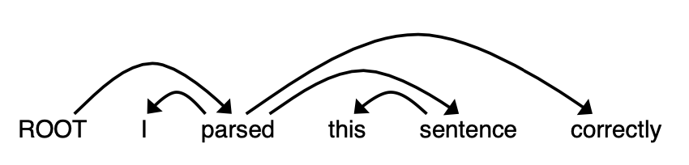
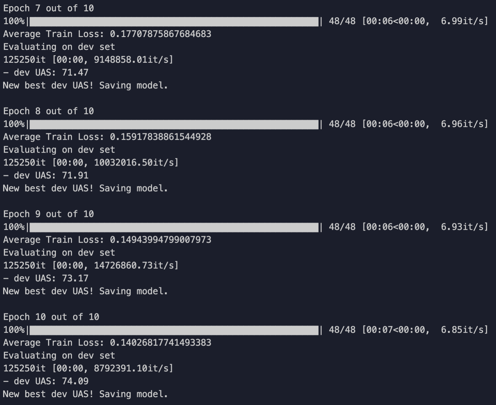
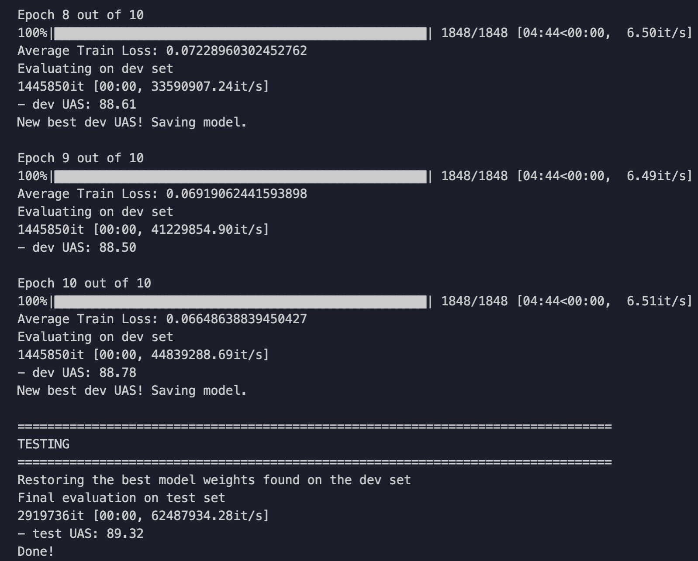
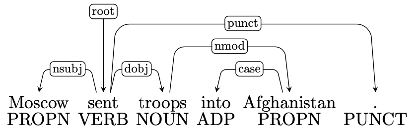
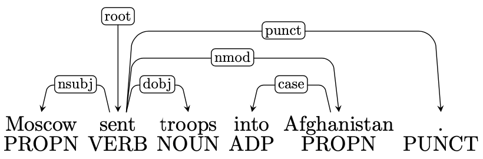
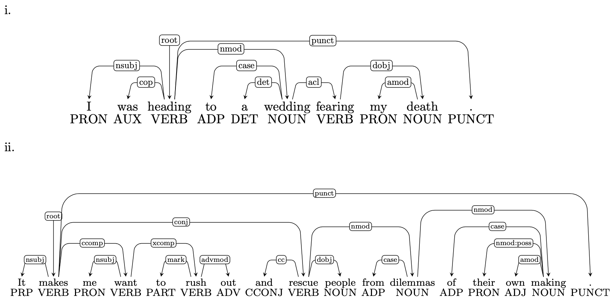
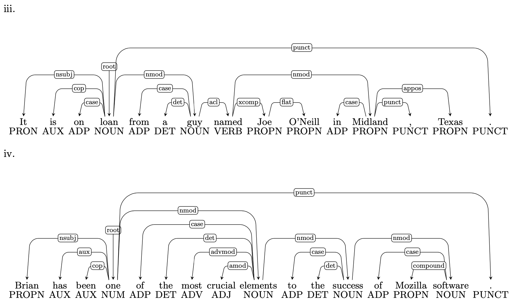

# CS 224n Assignment #3: Dependency Parsing

## Machine Learning & Neural Networks (8 points)

(a)(4 points) Adam Optimizer
Recall the standard Stochastic Gradient Descent update rule:
$$\theta \leftarrow \theta − \alpha \nabla_{\theta} J_{minibatch}(\theta)$$
where $\theta$ is a vector containing all of the model parameters,Jis the loss function, $\nabla_{\theta} J_{minibatch}(\theta)$ is the gradient of the loss function with respect to the parameters on a mini batch of data, and $\alpha$ is the learning rate. Adam Optimization$^1$ uses a more sophisticated update rule with two additional steps.$^2$
i. (2 points) First, Adam uses a trick called momentum by keeping track of m, a rolling average of the gradients:
$$m \leftarrow \beta_1 m + (1 − \beta1) \nabla_{\theta}J_{minibatch}(\theta)$$
$$\theta \leftarrow \theta − \alpha m$$
where $\beta_1$ is a hyperparameter between 0 and 1 (often set to 0.9). Briefly explain (you don’t need to prove mathematically, just give an intuition) how using m stops the updates from varying as much and why this low variance may be helpful to learning, overall.
> Answer: According to the equation, the new gradient is controlled by $1 - \beta$, in which $\beta$ is often set to 0.9. Then $m$ is affected more by the previous m but less by the current gradient. It prevent the gradient exploding problem. Thanks to it, $\theta$ is update steadily.

ii. (2 points) Adam also uses adaptive learning rates by keeping track of $v$, a rolling average of the magnitudes of the gradients:
$$m \leftarrow \beta_1 m + (1 − \beta_1)\nabla_{\theta}J_{minibatch}(\theta)$$
$$v \leftarrow \beta_2 v + (1 − \beta_2)(\nabla_{\theta}J_{minibatch}(\theta) \odot \nabla_{\theta}J_{minibatch}(\theta))$$
$$\theta \leftarrow \theta − \alpha \odot m / \sqrt{v}$$
where $\odot$ and / denote elementwise multiplication and division (so $z \odot z$ is elementwise squaring)and $\beta_2$ is a hyperparameter between 0 and 1 (often set to 0.99). Since Adam divides the update by $\sqrt{v}$, which of the model parameters will get larger updates? Why might this help with learning?

>Answer: Since elementwise binary operation is involved, the parameter with smaller gradient parameter will update larger than others.
>It scales the learning state of the parameters like mentioned above. So the learning will become more steadily and avoid the local optimization.

(b) (4 points) Dropout$^3$ is a regularization technique. During training, dropout randomly sets units in the hidden layer $h$ to zero with probability $p$ drop(dropping different units each minibatch), and then multiplies $h$ by a constant $γ$. We can write this as
$$h_{drop} = \gamma d \circ h$$
where $d \in {0,1}^{D_h}$($D_h$ is the size of $h$) is a mask vector where each entry is 0 with probability $p_drop$ and 1 with probability ($1−p_{drop}$). $\gamma$ is chosen such that the expected value of $h_{drop}$ is h:
$$\mathbb{E}_{p_{drop}}[h_{drop}]_i = h_i$$
for all $i \in {1, \dot ,D_h}$.


i. (2 points) What must $\gamma$ equal in terms of $p_{drop}$? Briefly justify your answer.
>Answer: $\gamma = \frac{1}{1-p_{drop}}$
>
>Proof: $\sum_i [h_{drop}]_i = \gamma \sum_i (1-p_{drop})h_i = \gamma (1-p_{drop}) \sum_i h_i = \gamma (1-p_{drop}) E[h] = E[h] \rightarrow \gamma = \frac{1}{1-p_{drop}}$

ii. (2 points) Why should we apply dropout during training but not during evaluation?
>Answer: If we drop out during evaluation time, the model's performance will be randomly. It could not show the model reality.

## Neural Transition-Based Dependency Parsing (42 points)

A dependency parser analyzes the grammatical structure of a sentence, establishing relationships between *head* words, and words which modify those heads. Your implementation will be a transition-based parser, which incrementally builds up a parse one step at a time. At every step it maintains a partial parse, which is represented as follows:

- A *stack* of words that are currently being processed.
- A *buffer* of words yet to be processed.
- A list of *dependencies* predicted by the parser.

Initially, the stack only contains **ROOT**, the dependencies list is empty, and the buffer contains all words of the sentence in order. At each step, the parser applies a transition to the partial parse until its buffer is empty and the stack size is 1. The following transitions can be applied:

- **SHIFT**: removes the first word from the buffer and pushes it onto the stack.
- **LEFT-ARC**: marks the second (second most recently added) item on the stack as a dependent of the first item and removes the second item from the stack.
- **RIGHT-ARC**: marks the first (most recently added) item on the stack as a dependent of the second item and removes the first item from the stack.

On each step, your parser will decide among the three transitions using a neural network classifier.

(a)(6 points) Go through the sequence of transitions needed for parsing the sentence "I parsed this sentence correctly”. The dependency tree for the sentence is shown below. At each step, give the configuration of the stack and buffer, as well as what transition was applied this step and what new dependency was added (if any). The first three steps are provided below as an example.



|Stack|Buffer|New dependency|Transition|
|:-:|:-:|:-:|:-:|
|[ROOT]|[I, parsed, this, sentence, correctly]||Initial Configuration|
|[ROOT, I]|[parsed, this, sentence, correctly]||SHIFT|
|[ROOT, I, parsed]|[this, sentence, correctly]||SHIFT|
|[ROOT, parsed]|[this, sentence, correctly]|parsed→I|LEFT-ARC|

>Answer:
>|Stack|Buffer|New dependency|Transition|
>|:-:|:-:|:-:|:-:|
>|[ROOT]|[I, parsed, this, sentence, correctly]||Initial Configuration|
>|[ROOT, I]|[parsed, this, sentence, correctly]||SHIFT|
>|[ROOT, I, parsed]|[this, sentence, correctly]||SHIFT|
>|[ROOT, parsed]|[this, sentence, correctly]|parsed→I|LEFT-ARC|
>|[ROOT, parsed, this]|[sentence, correctly]||SHIFT|
>|[ROOT, parsed, this, sentence]|[correctly]||SHIFT|
>|[ROOT, parsed, sentence]|[correctly]|sentence->this|LEFT-ARC|
>|[ROOT, parsed]|[correctly]|parsed->sentence|RIGHT-ARC|
>|[ROOT, parsed, correctly]|[]||SHIFT|
>|[ROOT, parsed]|[]|parsed->correctly|RIGHT-ARC|
>|[ROOT]|[]|ROOT->parsed|RIGHT-ARC|

(b)(2 points)A sentence containing n words will be parsed in how many steps (in terms of n)? Briefly explain why.

>Answer: It needs $2n$ steps to complete the parsing without considering the initial step.
>For every word in buffer, it need *SHIFT* into the stack and *ARC* out of the stack. And there are $n$ words, so totally, $2n$ steps are needed.

(c)(6 points)Implement the `__init__` and `parse_step` functions in the `PartialParse` class in parser `transitions.py`. This implements the transition mechanics your parser will use. You can run basic (non-exhaustive) tests by running `python parser_transitions.py part_c`.

> Answer: Refer to the code folder

(d)(6 points)Our network will predict which transition should be applied next to a partial parse. We could use it to parse a single sentence by applying predicted transitions until the parse is complete. However, neural networks run much more efficiently when making predictions about batches of data at a time (i.e., predicting the next transition for any different partial parses simultaneously). We can parse sentences in mini batches with the following algorithm.

>**Algorithm 1** Minibatch Dependency Parsing
>**Input:** sentences, a list of sentences to be parsed and model, our model that makes parse decisions
>Initialize `partial_parses` as a list of PartialParses, one for each sentence in sentences
>Initialize `unfinished_parses` as a shallow copy of `partial_parses`
>**while** `unfinished_parses` is not empty **do**
> - Take the first batch_size parses in `unfinished_parses` as a minibatch
> - Use the model to predict the next transition for each partial parse in the minibatch
> - Perform a parse step on each partial parse in the minibatch with its predicted transition
> - Remove the completed (empty buffer and stack of size 1) parses from `unfinished_parses`
>
>**end while**
>**Return:** The dependencies for each (now completed) parse in `partial_parses`
>```

Implement this algorithm in the `minibatch_parse` function in `parser_transitions.py`. You can run basic (non-exhaustive) tests by running `python parser_transitions.py part_d`.
*Note: You will need `minibatch_parse` to be correctly implemented to evaluate the model you will build in part (e). However, you do not need it to train the model, so you should be able to complete most of part (e) even if `minibatch_parse` is not implemented yet.*

We are now going to train a neural network to predict, given the state of the stack, buffer, and dependencies, which transition should be applied next. First, the model extracts a feature vector representing the current state. We will be using the feature set presented in the original neural dependency parsing paper: *A Fast and Accurate Dependency Parser using Neural Networks*.$^4$ The function extracting these features has been implemented for you in `utils/parser_utils.py`. This feature vector consists of a list of tokens (e.g., the last word in the stack, first word in the buffer,dependent of the second-to-last word in the stack if there is one, etc.). They can be represented as a list of integers $[w_1,w_2, \dots ,w_m]$ where $m$ is the number of features and each $0 \le w_i \lt |V|$ is the index of a token in the vocabulary ($|V|$ is the vocabulary size). First our network looks up an embedding for each word and concatenates them into a single input vector:
$$x = [E_{w_1}, \dots , E_{w_m}] \in \mathbb{R}^{dm}$$
where $E \in \mathbb{R}^{|V| \times d}$ is an embedding matrix with each row $E_w$ as the vector for a particular word $w$.

We then compute our prediction as:
$$h = ReLU(xW+b_1)$$
$$l=hU+b_2$$
$$\hat{y} = softmax(l)$$
where $h$ is referred to as the hidden layer, $l$ is referred to as the logits, $\hat{y}$ is referred to as the predictions, and $ReLU(z) = max(z,0))$. We will train the model to minimize cross-entropy loss:
$$J(\theta) = CE(y,\hat{y}) = −\sum^{3}_{i=1} y_i log \hat{y_i}$$

To compute the loss for the training set, we average this $J(\theta)$ across all training examples.

> Answer: Refer to the code folder

(e)(10 points)In `parser_model.py` you will find skeleton code to implement this simple neural net-work using PyTorch. Complete the `__init__`, `embedding_lookup` and `forward` functions to implement the model. Then complete the `train_for_epoch` and `train` functions within the `run.py` file.

Finally execute `python run.py` to train your model and compute predictions on test data from Penn Tree bank (annotated with Universal Dependencies). Make sure to turn off debug setting by setting `debug=False` in the `main` function of `run.py`.

**Hints:**
- When debugging, set `debug=True` in the `main` function of `run.py`. This will cause the code to run over a small subset of the data, so that training the model won’t take as long. Make sure to set `debug=False` to run the full model once you are done debugging.
- When running with `debug=True`, you should be able to get a loss smaller than 0.2 and a UAS larger than 65 on the dev set (although in rare cases your results may be lower, there is some randomness when training).•It should take about 1 hour to train the model on the entire the training dataset, i.e., when `debug=False`.
- When running with `debug=False`, you should be able to get a loss smaller than 0.08 on the train set and an Unlabeled Attachment Score larger than 87 on the dev set. For comparison,the model in the original neural dependency parsing paper gets 92.5 UAS. If you want, you can tweak the hyperparameters for your model (hidden layer size, hyperparameters for Adam,number of epochs, etc.) to improve the performance (but you are not required to do so)

**Deliverables:**
- Working implementation of the neural dependency parser in `parser_model.py`. (We’ll look at and run this code for grading).
- Report the best UAS your model achieves on the dev set and the UAS it achieves on the test set

> Answer: Refer to the code folder
> Result images are below:
> - `Debug = True`
>   
> - `Debug = False`
>   


(f) (12 points) We’d like to look at example dependency parses and understand where parsers like ours might be wrong. For example, in this sentence:



the dependency of the phrase into *Afghanistan* is wrong, because the phrase should modify *sent*(as in *sent into Afghanistan*) not troops(because *troops into Afghanistan* doesn’t make sense). Here is the correct parse:



More generally, here are four types of parsing error:
- **Prepositional Phrase Attachment Error:** In the example above, the phrase into Afghanistan is a prepositional phrase. A Prepositional Phrase Attachment Error is when a prepositional phrase is attached to the wrong head word (in this example,troops is the wrong head word and sent is the correct head word). More examples of prepositional phrases include with a rock, before midnight and under the carpet.
- **Verb Phrase Attachment Error:**  In the sentenceLeaving the store unattended, I went outside to watch the parade, the phrase leaving the store unattended is a verb phrase. A VerbPhrase Attachment Error is when a verb phrase is attached to the wrong head word (in this example, the correct head word is went).
- **Modifier Attachment Error:** In the sentenceI am extremely short, the adverb extremely is a modifier of the adjective short. A Modifier Attachment Error is when a modifier is attached to the wrong head word (in this example, the correct head word is short).
- **Coordination Attachment Error:** In the sentenceWould you like brown rice or garlic naan?,the phrases brown rice and garlic naan are both conjuncts and the word or is the coordinating conjunction. The second conjunct (here garlic naan) should be attached to the first conjunct(here brown rice). A Coordination Attachment Error is when the second conjunct is attached to the wrong head word (in this example, the correct head word is rice). Other coordinating conjunctions include and, but and so.

In this question are four sentences with dependency parses obtained from a parser. Each sentence has one error, and there is one example of each of the four types above. For each sentence, state the type of error, the incorrect dependency, and the correct dependency. To demonstrate: for the example above, you would write:

- **Error type:** Prepositional Phrase Attachment Error
- **Incorrect dependency:** troops→Afghanistan
- **Correct dependency:** sent→Afghanistan

*Note: There are lots of details and conventions for dependency annotation. If you want to learn more about them, you can look at the UD website: http://universaldependencies.org.5However, you do not need to know all these details in order to do this question. In each of these cases, we are asking about the attachment of phrases and it should be sufficient to see if they are modifying the correct head. In particular, you do not need to look at the labels on the the dependency edges – it suffices to just look at the edges themselves.*





>Answer:
> - i
>   - **Error type:** Verb Phrase Attachment Error
>   - **Incorrect dependency:**  wedding → fearing
>   - **Correct dependency:** heading → fearing
> - ii
>   - **Error type:** Coordination Phrase Attachment Error
>   - **Incorrect dependency:** makes → rescue
>   - **Correct dependency:** want → rescue
> - iii
>   - **Error type:** Preposition Phrase Attachment Error
>   - **Incorrect dependency:** named → Midland
>   - **Correct dependency:** guy → Midland
> - iv
>   - **Error type:** Modifier Phrase Attachment Error
>   - **Incorrect dependency:** elements → most
>   - **Correct dependency:** crucial → elements

1. Kingma and Ba, 2015,https://arxiv.org/pdf/1412.6980.pdf
2. The actual Adam update uses a few additional tricks that are less important, but we won’t worry about them here.
3. Srivastava et al., 2014,https://www.cs.toronto.edu/ ̃hinton/absps/JMLRdropout.pdf1
4. Chen and Manning, 2014,http://cs.stanford.edu/people/danqi/papers/emnlp2014.pdf
5. But note that in the assignment we are actually using UDv1, see:http://universaldependencies.org/docsv1/