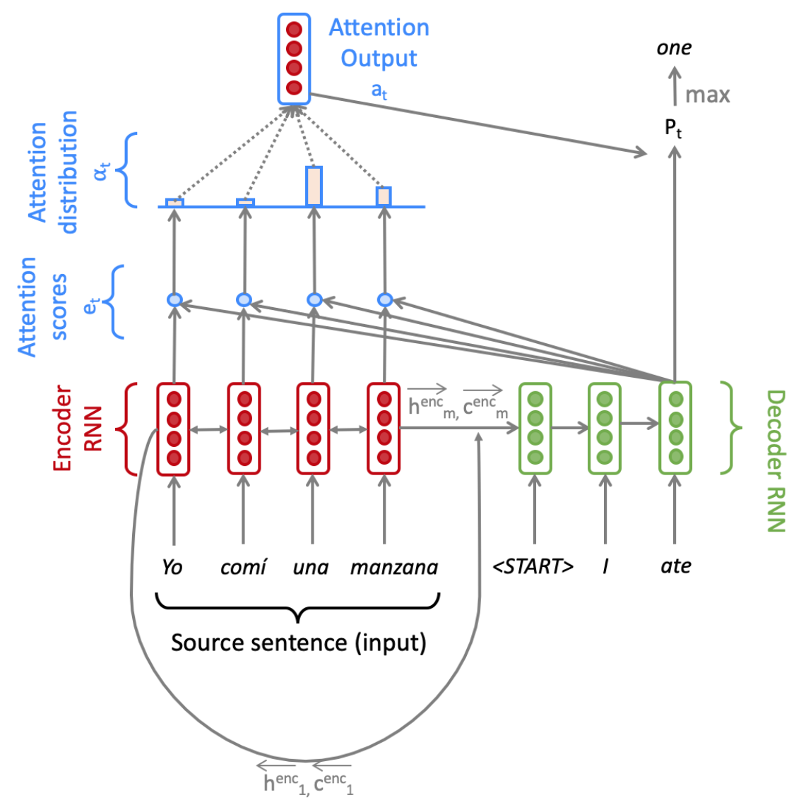

# CS 224n: Assignment #4

## Neural Machine Translation with RNNs (45 points)

In Machine Translation, our goal is to convert a sentence from the source language (e.g. Spanish) to the target language (e.g. English). In this assignment, we will implement a sequence-to-sequence (Seq2Seq)network with attention, to build a Neural Machine Translation (NMT) system.  In this section, we describe the training procedure for the proposed NMT system, which uses a Bidirectional LSTM Encoder and a Unidirectional LSTM Decoder



<center>Figure 1: Seq2Seq Model with Multiplicative Attention, shown on the third step of the decoder. Note that for readability, we do not picture the concatenation of the previous combined-output with the decoder input.</center>

Given a sentence in the source language, we look up the word embeddings from an embeddings matrix,yielding $x_1, \dots ,x_m|x_i \in \mathbb{R}^{e \times 1}$, where $m$ is the length of the source sentence and $e$ is the embedding size. We feed these embeddings to the bidirectional Encoder, yielding hidden states and cell states for both the forwards (→) and backwards (←) LSTMs. The forwards and backwards versions are concatenated to give hidden states $h^{enc}_i$ and cell states $c^{enc}_i$:

$h^{enc}_i = [\overleftarrow{h^{enc}_i}; \overrightarrow{h^{enc}_i}]$ where $h^{enc}_i \in \mathbb{R}^{2h×1}, \overleftarrow{h^{enc}_i}, \overrightarrow{h^{enc}_i}i \in \mathbb{R}^{h×1} 1$ $\lt i \lt m$ (1)
$c^{enc}_i = [\overleftarrow{c^{enc}_i}; \overrightarrow{c^{enc}_i}]$ where $c^{enc}_i \in \mathbb{R}^{2h×1}, \overleftarrow{c^{enc}_i}, \overrightarrow{c^{enc}_i}i \in \mathbb{R}^{h×1} 1$ $\lt i \lt m$ (2)

We then initialize the Decoder’s first hidden state $h^{dec}_0$ and cell state $c^{dec}_0$ with a linear projection of the Encoder’s final hidden state and final cell state.

$h^{dec}_0 = W_h[\overleftarrow{h^{enc}_1}; \overrightarrow{h^{enc}_m}]$ where $h^{enc}_0 \in \mathbb{R}^{h×1}, W_h \in \mathbb{R}^{h \times 2h}$ (3)
$c^{dec}_0 = W_c[\overleftarrow{c^{enc}_1}; \overrightarrow{c^{enc}_m}]$ where $c^{enc}_0 \in \mathbb{R}^{h×1}, W_c \in \mathbb{R}^{h \times 2h}$ (3)

With the Decoder initialized, we must now feed it a matching sentence in the target language. On the $t_{th}$ step, we look up the embedding for the $t^{th}$ word, $y_t \in \mathbb{R}^{e\times1}$.  We then concatenate $y_t$ with the *combined-output vector* $o_{t−1} \in \mathbb{R}^{h \times 1}$ from the previous time step (we will explain what this is later down this page!) to produce $\overline{y_t} \in \mathbb{R}^{(e+h) \times 1}$. Note that for the first target word (i.e. the start token) $o_0$ is a zero-vector. We then feed $\overline{y_t}$ as input to the Decoder LSTM.

$h^{dec}_t, c^{dec}_t= Decoder(\overline{y_t}, h^{dec}_{t−1}, c^{dec}_{t-1})$ where $h^{dec}_t \in \mathbb{R}^{h \times 1}, c^{dec}_t \in \mathbb{R}^{h \times 1}$

We then use $h^{dec}_t$ to compute multiplicative attention over $h^{enc}_0, \dots, h^{enc}_m$:

$e_{t,i}= (h^{dec}_t)^T W_{attProj}h^{enc}_i$ where $e_t \in \mathbb{R}^{m \times 1}, W_{attProj} \in \mathbb{R}^{h \times 2h}$ $1 \lt i \lt m$(7)
$\alpha_t= Softmax(e_t)$ where $\alpha_t \in \mathbb{R}^{m \times 1}$(8)
$a_t=\sum_i^m \alpha_{t,i}h^{enc}_i$ where $a_t \in \mathbb{R}^{2h \times 1}$(9)

We now concatenate the attention output $a_t$ with the decoder hidden state $h^{dec}_t$ and pass this through a linear layer, Tanh, and Dropout to attain the combined-output vector $o_t$.

$u_t = [a_t; h^{dec}_t]$ where $u_t \in \mathbb{R}^{3h \times 1}$(10)
$v_t = W_u u_t$ where $v_t \in \mathbb{R}^{h \times 1},W_u \in \mathbb{R}^{h \times 3h}$(11)
$o_t = Dropout(Tanh(v_t))$ where $o_t \in \mathbb{R}^{h \times 1}$(12)

Then, we produce a probability distribution $P_t$ over target words at the $t^{th}$ timestep:

$P_t= Softmax(W_{vocab}o_t)$ where $P_t \in \mathbb{R}^{V_t \times 1}, W_{vocab} \in \mathbb{R}^{V_t \times h}$(13)

Here, $V_t$ is the size of the target vocabulary. Finally, to train the network we then compute the softmax cross entropy loss between $P_t$ and $g_t$, where $g_t$ is the 1-hot vector of the target word at timestep $t$:

$$J_t(\theta) = CE(P_t, g_t)(14)$$

Here, $\theta$ represents all the parameters of the model and $J_t(\theta)$ is the loss on step $t$ of the decoder. Now that we have described the model, let’s try implementing it for Spanish to English translation!

~~It takes approximately **4 hours** to train the NMT system with a **GPU**. *For trading off, locally success could be fine for me.* Whether finishing the total task **depends on you.**~~

In order to run the model code on your local machine, please run the following command to create the proper virtual environment:

```shell
conda env create --file localenv.yml
```

(a) (2 points) In order to apply tensor operations, we must ensure that the sentences in a given batch are of the same length. Thus, we must identify the longest sentence in a batch and pad others to be the same length. Implement the `pad_sents` function in `utils.py`, which shall produce these padded sentences.

>Answer: Refer to the code folder.

(b) (3 points) Implement the `__init__` function in `model_embeddings.py` to initialize the necessary source and target embeddings.

>Answer: Refer to the code folder.

(c) (4 points) Implement the `__init__` function in `nmt_model.py` to initialize the necessary model em-beddings (using the `ModelEmbeddings` class from `model_embeddings.py`) and layers (LSTM, projection, and dropout) for the NMT system.

>Answer: Refer to the code folder.

(d) (8 points) Implement the `encode` function in `nmt_model.py`. This function converts the padded source sentences into the tensor $X$, generates $h^{enc}_1, \dots, h^{enc}_m$, and computes the initial state $h^{dec}_0$ and initial cell $c^{dec}_0$ for the Decoder. You can run a non-comprehensive sanity check by executing:

```shell
python sanity_check.py 1d
```

>Answer: Refer to the code folder.

(e) (8 points) Implement the decode function in `nmt_model.py`. This function constructs $\bar{y}$ and runs the `step` function over every timestep for the input. You can run a non-comprehensive sanity check by executing:

```shell
python sanity_check.py 1e
```

>Answer: Refer to the code folder.

(f) (10 points) Implement the step function in `nmt_model.py`. This function applies the Decoder’s LSTM cell for a single timestep, computing the encoding of the target word $h^{dec}_t$, the attention scores $e_t$, attention distribution $\alpha_t$, the attention output $a_t$, and finally the combined output $o_t$. You can run a non-comprehensive sanity check by executing:

```shell
python sanity_check.py 1f
```

>Answer: Refer to the code folder.

(g)  (3 points)  (written) The `generate_sent_masks()` function in `nmt_model.py` produces a tensor called `enc_masks`. It has shape (batch size, max source sentence length) and contains 1s in positions corresponding to 'pad' tokens in the input, and 0s for non-pad tokens.  Look at how the masks are used during the attention computation in the `step()` function (lines 295-296). First explain (in around three sentences) what effect the masks have on the entire attention computation.   Then  explain  (in  one  or  two  sentences)  why  it  is  necessary  to  use  the  masks  in  this way.

>Answer:
>1. The mask helps set e_t to -inf where its value is 1. The -inf value which refers to the pad token, will be approximately to 0 in attention after applying softmax. So it won't affect the complete sentence.
>2. We use pad token to make sentences within a mini batch to have same length, so they can be calculated at same time. When computing the attention to retrieve the semantic info, the pad token means nothing so mask is applied to eliminate the added token.

(h)  Now it’s time to get things running!  Execute the following to generate the necessary vocab file:

```shell
sh run.sh vocab
```

As noted earlier, we recommend that you develop the code on your personal computer.  Confirm that you are running in the proper conda environment and then execute the following command to train the model on your local machine:

```shell
sh run.sh train_local
```

Once you have ensured that your code does not crash (i.e.  let it run till `iter` 10 or `iter` 20),power on your VM from the Azure Web Portal.  Then read the *Managing  Code  Deployment  to  a VM* section of our Practical Guide to VMs (link also given on website and Piazza) for instructions on how to upload your code to the VM. Next, install necessary packages to your VM by running:

```shell
pip install -r gpu_requirements.txt
```

Finally,  turn to the *Managing  Processes  on  a  VM* section of the Practical Guide and follow the instructions to create a new tmux session.  Concretely, run the following command to create tmux session called `nmt`.

```shell
tmux new -s nmt
```

Once your VM is configured and you are in a tmux session, execute:

```shell
sh run.sh train
```

Once  you  know  your  code  is  running  properly,  you  can  detach  from  session  and  close  your  ssh connection to the server.  To detach from the session, run:

```shell
tmux detach
```

You can return to your training model by ssh-ing back into the server and attaching to the tmux session by running:

```shell
tmux a -t nmt
```

(i)  (4 points)  Once your model is done training (this should take about 4 hours on the VM), execute the following command to test the model:

```shell
sh run.sh test
```

Please report the model’s corpus BLEU Score.  It should be larger than 21.

(j)  (3 points)  In class, we learned about dot product attention, multiplicative attention, and additive attention.  Please provide one possible advantage and disadvantage of each attention mechanism, with respect to either of the other two attention mechanisms.  As a reminder, dot product attention is $e_{t,i} = s^T_th_i$, multiplicative attention is $e_{t,i} = s^T_tWh_i$, and additive attention is $e_{t,i} = v^T(W_1h_i + W_2s_t)$.

>Answer:
>||Advantage|Disadvantage|
>|:-:|:-:|:-:|
>|dot product attention|No another linear transfer layer|$s^T_t$ and $h_t$ must have the same dimension|
>|multiplicative attention|$s^T_t$ and $h_t$ do not require the same dimension|New parameters to learn|
>|additive attention|**Wait for answer**|More new parameters to learn|
